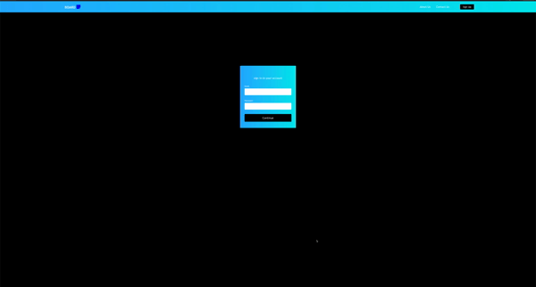
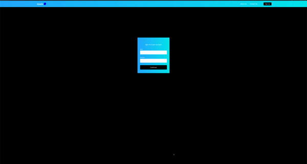
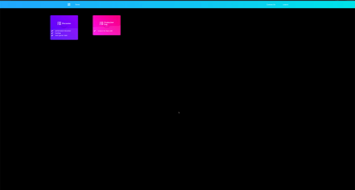
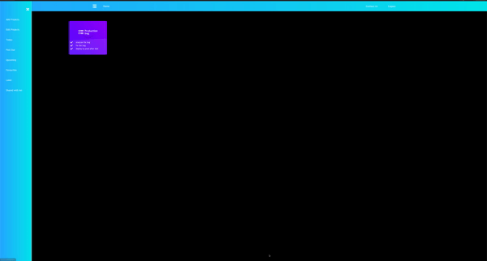
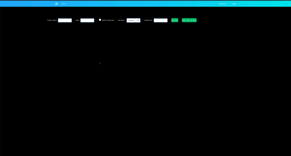
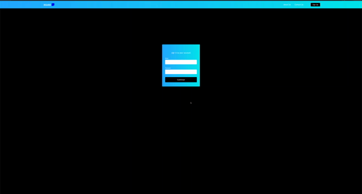
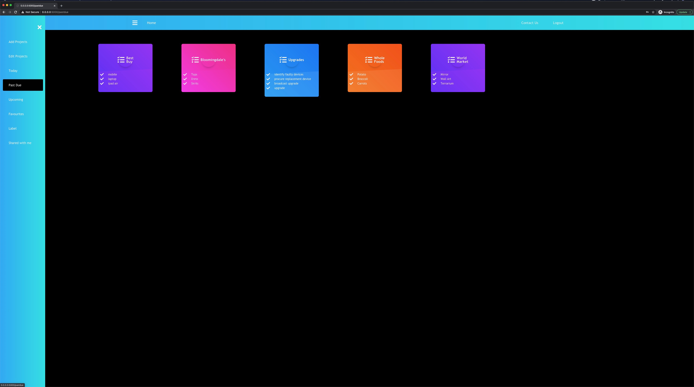
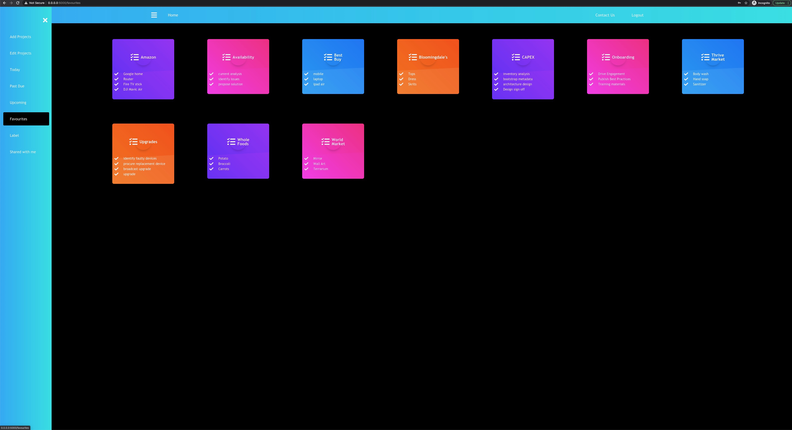
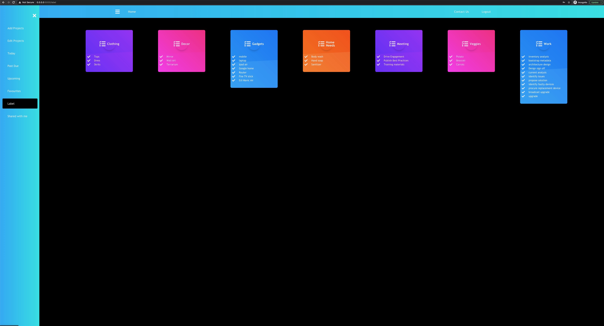

# BOARD 
<br>
<br>
BOARD is a web app that can be used to categorize and organize tasks. In BOARD, users can create projects and add tasks to projects. Once the projects and tasks are created, users will have the ability to edit/delete/mark complete the tasks in a project. Users can also favorite projects so that they can group all their favorite projects and view them on a single page. BOARD lets users assign labels to projects so that multiple projects can be grouped by labels. Users can also assign due dates to the projects thereby having the ability to group projects based on due dates. BOARD supports collaboration. It allows users to add other BOARD users as collaborators to projects so that multiple users can work on a project.
<br>

# Contents
* [Features](#features)
* [Technologies & Stack](#techstack)
* [Set-up & Installation](#installation)
* [About the Developer](#aboutme)

## <a name="features"></a> Features

About Us - A quick intro
<br>
<br>

<br>

Sign Up Page that includes validations
<br>
<br>

<br>

Login and Home Page
<br>
<br>

<br>

Add a New Project, give a Label name, assign due date, add to favourites
<br>
<br>

<br>

Edit Tasks
<br>
<br>

<br>

Add a Collaborator and assign due dates
<br>
<br>

<br>

Shared with me
<br>
<br>

<br>

Board for all projects that are past due
<br>
<br>

<br>

Board for all projects that are upcoming
<br>
<br>

<br>

Board for all favorite Projects
<br>
<br>

<br>

Board for all projects with Labels
<br>
<br>

<br>

## <a name="techstack"></a> Technologies and Stack
**Backend:**
Python, Flask, SQLAlchemy, PostgreSQL <br>
**Frontend:**
React, Javascript, jQuery, Babel, Bootstrap, Google Fonts, HTML5, CSS, Styled Components <br>

## <a name="installation"></a> Set-up & Installation
Install a code editor such as [VS code](https://code.visualstudio.com/download) or [Sublime Text](https://www.sublimetext.com/).<br>
Install [Python3](https://www.python.org/downloads/mac-osx/)<br>
Install [pip](https://pip.pypa.io/en/stable/installing/), the package installer for Python <br>
Install [postgreSQL](https://www.postgresql.org/) for the relational database.<br>


Clone or fork repository:
```
$ git clone https://github.com/rlavanya9/BOARD.git
```
Create and activate a virtual environment inside the BOARD directory:
```
$ virtualenv env
$ source env/bin/activate
```
Install dependencies:
```
$ pip3 install -r requirements.txt
```
Store these keys in a file named 'secrets.sh' <br> 
```
$ source secrets.sh
```
With PostgreSQL, create the BOARD database
```
$ createdb mytodo
```
Create all tables and relations in the database and seed all data:
```
$ python3 seed_database.py
```
Run the app from the command line:
```
$ python3 server.py
```

## <a name="aboutme"></a> About the Developer

Lavanya was a Mainframe Technology Lead at Morgan Stanley where she was responsible for developing and maintaining applications for the Wealth and Asset management Division. Prior to that, she developed Billing and Commission modules for Guardian Life Insurance.  She has her B.S. in Computer Science Engineering and over 10 years of experience in the Software industry. She is also a Certified Scrum Master. Having gained knowledge and expertise in backend/mainframe technology, she wanted to pursue more expressive, flexible languages like Python and JavaScript and to gain hands-on experience working on them. She's looking forward to an exciting career building innovative and robust applications. She can be found on [LinkedIn](https://www.linkedin.com/in/lavanya-rangaswamy/) and on [Github](https://github.com/rlavanya9).